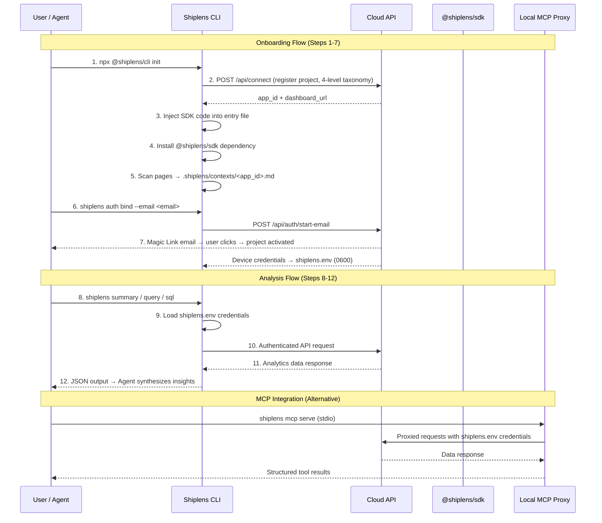

# Shiplens CLI Command Reference

> Complete documentation for all Shiplens CLI commands, flags, arguments, and sample outputs for AI Agent execution.

---

## Global Flags

| Flag | Type | Description |
| :--- | :--- | :--- |
| `--json` | boolean | Output results in JSON format (required for AI Agents) |
| `--app-id <id>` | string | Explicitly specify target `app_id` (default: auto-read from `.shiplens.json`) |
| `--env <env>` | string | Target environment: `production` (default) or `staging` |
| `--secret <key>` | string | Explicitly pass Access Secret |
| `--api-url <url>` | string | Custom backend API base URL (default: `http://120.26.230.33`) |
| `--help`, `-h` | boolean | Display help information |

---

## 1. Project Onboarding (`init`)

```bash
shiplens init [options]
```

### Options:
- `--name <name>`: Project name (default: package.json name)
- `--description <desc>`: Project description
- `--industry <ind>`: Industry category
- `--genre <id>`: Level 1 Genre ID
- `--subgenre <id>`: Level 2 Sub-genre ID
- `--tags <tag1,tag2>`: Comma-separated feature tag IDs (max 10)
- `--email <email>`: Binding email (pass `auto` to use git config)
- `--framework <type>`: Override detected framework (`nextjs-app`, `nextjs-pages`, `vite`, `vue`, `html`)
- `--force`: Force overwrite existing local configuration
- `--no-install`: Skip package manager installation
- `--no-commit`: Skip automatic Git commit

---

## 2. Authentication (`auth`)

### Subcommands:
- `shiplens auth status`: Check credential validity
- `shiplens auth set [secret]`: Save Access Secret to `~/.shiplens/config.json`
- `shiplens auth whoami`: Display authenticated user details
- `shiplens auth logout`: Clear local credentials
- `shiplens auth bind --email <email>`: Request Magic Link activation email
- `shiplens auth mcp-config --client <client>`: Generate MCP client configuration
- `shiplens auth configure --client <client>`: Automatically write MCP configuration

---

## 3. Projects Management (`projects`)

### Subcommands:
- `shiplens projects list`: List all projects associated with current account
- `shiplens projects bind`: Bind current project to account
- `shiplens projects delete [--force]`: Delete project and its data

---

## 4. Multi-Dimensional Query (`query`)

```bash
shiplens query [options]
```

### Options:
- `--metric <name>` / `--metrics <m1,m2>`: Metric name(s)
- `--range <range>`: Time range (`24h`, `7d`, `14d`, `30d`, `90d`)
- `--grain <grain>`: Time grain (`hour`, `day`, `week`, `month`)
- `--group-by <dim>`: Group dimension (`path`, `template_id`, `country`, `browser`, `device_type`)
- `--filter <key=value>`: Filter condition (e.g. `--filter country=US`)
- `--limit <num>`: Result limit (default: 30)
- `--file <path>`: Load full `AnalyticsQueryRequest` from JSON file

---

## 5. Sandboxed SQL (`sql`)

```bash
shiplens sql --query "<sql>" [options]
```

### Options:
- `--query "<sql>"` / `--sql "<sql>"`: SQL query string
- `--stdin`: Read SQL query from stdin stream

---

## 6. Product Summary (`summary`)

```bash
shiplens summary [--range <range>]
```

Returns total PV, UV, average session duration, bounce rate, top countries, and top devices.

---

## 7. Page Telemetry (`pages`, `paths`, `canvas`)

- `shiplens pages [--range 7d] [--limit 10]`: Page-level visits and dwell times
- `shiplens paths [--range 7d]`: Sankey user flow and transition paths
- `shiplens canvas [--range 7d]`: Behavioral canvas node-link topology

---

## 8. Click Heatmaps (`heatmap`)

```bash
shiplens heatmap --template <template_id> [--dom-hash <hash>]
```

Returns skeleton wireframe SVG URL, total clicks, and element click distribution.

---

## 9. AI Dashboards (`dashboards`)

- `shiplens dashboards list`: List all dashboards for project
- `shiplens dashboards create --title "..." --prompt "..."`: Create responsive dashboard via prompt
- `shiplens dashboards create --ai --prompt "..."`: AI-driven dashboard generation

---

## 10. Environment Diagnostics (`doctor`)

```bash
shiplens doctor [--json]
```

Performs health checks on:
1. `local_config`: `.shiplens.json` validity
2. `sdk_dependency`: `@shiplens/sdk` in `package.json`
3. `code_injection`: SDK import in entry files
4. `ingestion_connectivity`: Network latency to API
5. `auth_credential`: Access secret resolution
6. `email_binding`: Quota activation status
7. `schema_freshness`: Schema synchronization age

---

## 11. Action Presets (`action`)

```bash
shiplens action [action_id] [--list] [--json]
```

- `shiplens action --list`: List all 42 textbook growth & analytics actions and categories
- `shiplens action <action_id>`: Retrieve deterministic execution steps, CLI commands, and methodology theory for a specific scenario (e.g. `lifecycle_stage`, `customer_ltv`)

---

The full data flow from user action to analytics delivery:



### Component Roles

| Component | Responsibility |
|-----------|---------------|
| **CLI** (`npx @shiplens/cli`) | Onboarding, SDK injection, local config management, direct analytics queries |
| **Cloud API** | Project registration, authentication, data aggregation, dashboard hosting |
| **SDK** (`@shiplens/sdk`) | Client-side event capture (pageviews, clicks, custom events), DOM hashing |
| **shiplens.env** | Device-level credentials (Access Secret), file permission 0600, auto-gitignored |
| **Local MCP Proxy** (`shiplens mcp serve`) | stdio bridge for IDE/Agent integration, forwards requests with local credentials |
| **.shiplens.json** | Project metadata cache (app_id, project_name, schema timestamp) |
| **.shiplens/contexts/\<app_id\>.md** | Business context dictionary (page routes, button labels, feature descriptions) |
| **.shiplens/learnings.md** | User preference overrides (date range, metrics, filters) |

